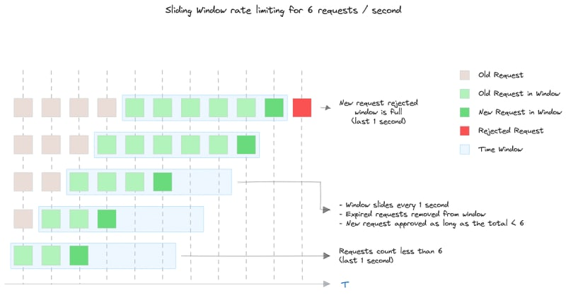
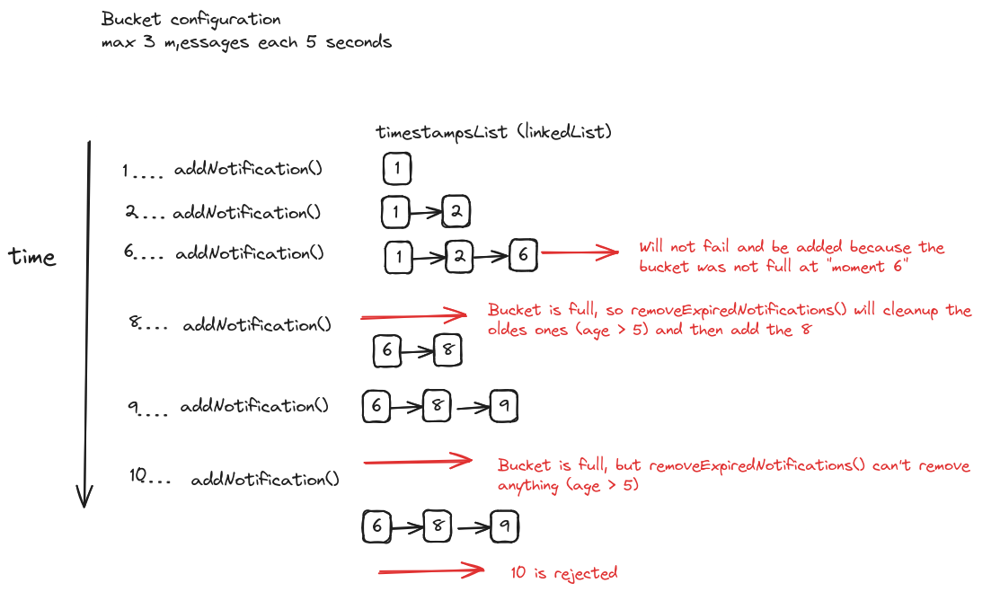

# rate_limit_challenge


## project requeriments
- java 17+
- gradle


This project solves : [Challenge - Rate Limit](./challenge.md)


## run tests:

execute the script:


```bash
./test.sh
```
build and test the project ... and then open jacoco test coverage report in a firefox web browser

(edit ./test.sh file to change webBrowser binary to open [PROJECT_ROOT]/build/jacocoHtml web page report)


## The Solution:

NOTES :
- This solution does not use any framework/DB to keep as simple as I can.
- Users (and types) count is a "low number"... so a memory map is Ok for this example  
- To scale we could move the buckets map to a REDIS (to handle distributed microservices replicas concurrency)


The solution is to implement a Sliding window for each type/userId




The main class is the *WindowBucket* that implements a sliding window with this attributes:

```java

    // window time
    protected long timesliceSeconds;

    // max size of the Window
    protected int bucketSize;

    // is a sorted linked list of sent notifications timestamps
    // list size must be <=< bucketSize
    protected LinkedList<Long> timestampsList;
```


- main method is inner method **add()** ... that is called from public method **addNotification()**

```java


/**
 * try to add a new Notification if there is room in this window bucket
 * throws RateLimitExceededException if bucket is full
 */
public synchronized void addNotification() {
    Long timeNowSeconds = System.currentTimeMillis() / 1000;
    add(timeNowSeconds);
}

/**
 * INNER METHOD: Created to make this class more testable
 * <p>
 * try to add a new Notification if there is room in this window bucket
 *
 * @param notificationTimeInSeconds notification TimeStamp in seconds
 * @throws RateLimitExceededException if bucket is full
 */
protected void add(Long notificationTimeInSeconds) {
    // try to clean expired ts (ts that are outside current sliding window)
    removeExpiredNotifications(notificationTimeInSeconds);

    if (timestampsList.size() < bucketSize) {
        // there is room for another notification in the bucket
        // timestamps are stored from descending in order (oldest go fist, the new is added at last)
        timestampsList.addLast(notificationTimeInSeconds);
    } else {
        // check if there is room for a new notification
        throw new RateLimitExceededException(WINDOW_BUCKET_IS_FULL_MESSAGE);
    }
}

```


removeExpiredNotifications will remove from the bucket list (a sorted linked list) the ts outside the window at a given time

here is an example of the inner list for a rate limit of 3 msg each 5 secs: 

